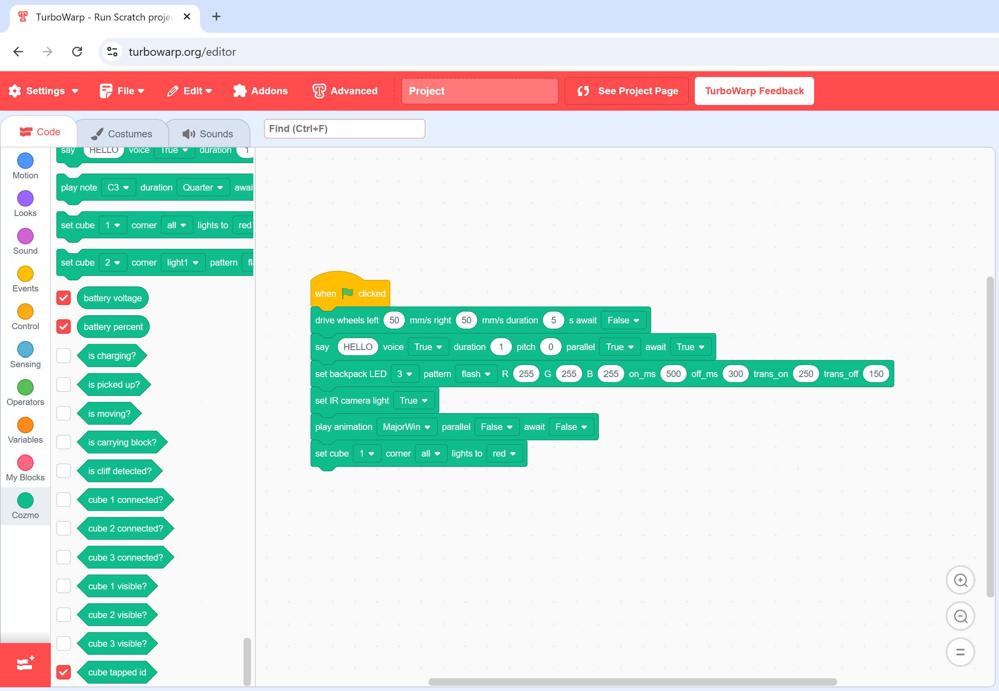

Scratch for Cozmo (Scratch4Cozmo)
===========================================
Official Cozmo control tools let kids program the robot using the Code Lab app, which is available only on mobile devices.
There is no Scratch integration for regular computers.
This project aims to bridge that gap by enabling Cozmo control directly from Scratch on desktop and laptop devices — making robot programming more accessible and versatile.

This repository contains a minimal WebSocket bridge server (`server.py`) that
proxies commands between a local installation of the Cozmo Python SDK and a
client-side Scratch/TurboWarp extension (`extension.js`). The bridge uses JSON
messages over WebSocket and can stream camera frames as binary
payloads (JSON header + image bytes).



Unlike other projects or the official Cozmo Code Lab, the control blocks provided in this project are more deeply integrated with the Cozmo SDK.
Key advantages include:
- Support for await and asynchronous SDK functions.
- More parameters available for SDK functions, allowing finer control.

Contents
--------
- `requirements.txt` - Python dependencies.
- `server.py` - Server connected to the Cozmo SDK.
- `extension.js` - Client-side Scratch/TurboWarp extension connected to server.

Installation
------------

### TL;DR
Make sure the Cozmo robot is paired with your phone and the phone is reachable from your computer. Install Python 3.8, clone or copy this repository, create and activate a virtual environment, install dependencies from `requirements.txt`, run `server.py`, then open the TurboWarp (or Scratch) editor and load `extension.js` as a custom extension.

### Detailed steps
#### 1. Run Cozmo in SDK mode
It is a built-in capability of Cozmo, so there is [official documentation](https://data.bit-bots.de/cozmo_sdk_doc/cozmosdk.anki.com/docs/initial.html) for that,
and there are also many [unofficial videos and instructions available on the web](https://brut.me/viewforum.php?f=244&sid=817fd06c5f82d1eeb650f8c63abd10b7); for example these for [Windows + iOS](https://www.youtube.com/watch?v=qTNUzbyih9I) and [Windows + Android](https://www.youtube.com/watch?v=eeFLyTfKGfQ).

Simply put, what we need at this stage is:
- Cozmo itself.
- An iOS or Android smartphone with the latest (3.4.0) Cozmo app installed.
- The smartphone must be connected to the computer via USB cable.
    - With Android you also need to [install Android Debug Bridge (adb) on your computer](https://github.com/anki/cozmo-python-sdk/blob/dd29edef18748fcd816550469195323842a7872e/docs/source/adb.rst).

So: smartphone connected to Cozmo via WiFi, Cozmo mobile app in SDK mode, computer connected to smartphone via USB.


#### 2. Make TurboWarp / Scratch work with Cozmo 
2.1) Install Python 3.8 if you don't already have it. Prefer the official installer from python.org.

Important: when installing on Windows, check the box "Add Python 3.8 to PATH" in the installer. This makes the `python` and `pip` commands available in PowerShell. If you already have a different Python version installed, install Python 3.8 side-by-side and create the virtual environment using the 3.8 interpreter (examples below). Do not assume the system `python` points to 3.8.
If you want to add Python to PATH manually: open Start → "Edit the system environment variables" → Environment Variables → under your User variables select `Path` → Edit → New → add the folder that contains `python.exe` (for example `C:\Users\<you>\AppData\Local\Programs\Python\Python38\`).

- Quick checks (PowerShell):

```powershell
python --version        # shows default python if on PATH
py -3.8 --version      # shows installed python 3.8 if the py launcher is present
where python           # shows which python executable is found first in PATH
```

2.2) Create the virtual environment with Python 3.8 specifically:

- If you have the Python launcher (`py`) installed:
```powershell
py -3.8 -m venv .venv
```

- Or use the full path to the Python 3.8 executable (example path - adapt to your install):
```powershell
C:\Users\<you>\AppData\Local\Programs\Python\Python38\python.exe -m venv .venv
```

- If `python` already points to 3.8 then this also works:
```powershell
python -m venv .venv
```

2.3) Create a directory for the project (for example `scratch4cozmo`), change into it, then copy or clone the project files into that directory.

```powershell
mkdir scratch4cozmo
cd scratch4cozmo
```

To clone the repository into the current directory:

```powershell
git clone https://github.com/akomarovich/scratch4cozmo.git .
```

Or copy the project files into `scratch4cozmo` manually.

2.4) Activate a virtual environment:

```powershell
python -m venv .venv
.\.venv\Scripts\Activate.ps1
```

- If PowerShell blocks script execution, run (once) to allow activating the venv in your user session:

```powershell
Set-ExecutionPolicy -ExecutionPolicy RemoteSigned -Scope CurrentUser -Force
```

- Upgrade pip and install dependencies:

```powershell
python -m pip install --upgrade pip
pip install -r requirements.txt
```

2.5) With the venv activated and from `scratch4cozmo` directory, start the server:

```powershell
python server.py
```

- Or run using the venv python explicitly:

```powershell
.\.venv\Scripts\python.exe server.py
```

The server will connect to the Cozmo SDK and listen for WebSocket clients. Check the console output for status messages.

2.6) Load the extension in TurboWarp / Scratch
- Open https://turbowarp.org/editor in your browser.
- Click "Add Extensions" (bottom-left button), choose "Custom Extension",
    then upload the file `extension.js` from this repository.
- The extension will attempt to connect to the bridge at
    ws://127.0.0.1:26966. 
    
Use the provided blocks to control Cozmo and read its sensors.
You will also see the camera stream from Cozmo — that is a good sign that everything is up and running smoothly.

#### 3. Troubleshooting tips
- PowerShell execution policy errors: either run the `Set-ExecutionPolicy` command above or activate the venv from cmd.exe using `.\.venv\Scripts\activate.bat`.
- If server goes "WARNING: No iOS device found running Cozmo" or/and "WARNING: No Android device found running Cozmo" then verify:

    ```bash
    adb version
    adb devices
    ```

    - To restart a stuck ADB server on Windows:

    ```powershell
    taskkill /F /IM adb.exe
    adb start-server
    adb devices
    ```

    - On Linux/macOS:

    ```bash
    pkill adb || killall adb || true
    adb start-server
    adb devices
    ```

    - If `adb devices` shows no devices, ensure the phone has USB debugging
        enabled and the phone is authorized to the host computer.


Final stuff
--------
All product names, logos, and brands mentioned in this repository (including
"Cozmo", "Anki", "Scratch", and "TurboWarp") are the property of their
respective owners. This project is independent and is not affiliated with,
endorsed by, or sponsored by any trademark owner. The author(s) of this
repository are not employees, agents, or representatives of those
organizations and make no claim of such a relationship.

This repository does not include the Cozmo SDK source code; the SDK is used
as a dependency via `requirements.txt` (the `cozmo` package) and is
copyrighted and licensed by its owners (see upstream SDK for license and
copyright information).

The software in this repository is provided "as is" without warranty of any
kind. The author(s) accept no liability for damages arising from use of the
software.

Use of any third-party trademarks or copyrighted materials is for
descriptive purposes only and does not imply any endorsement.